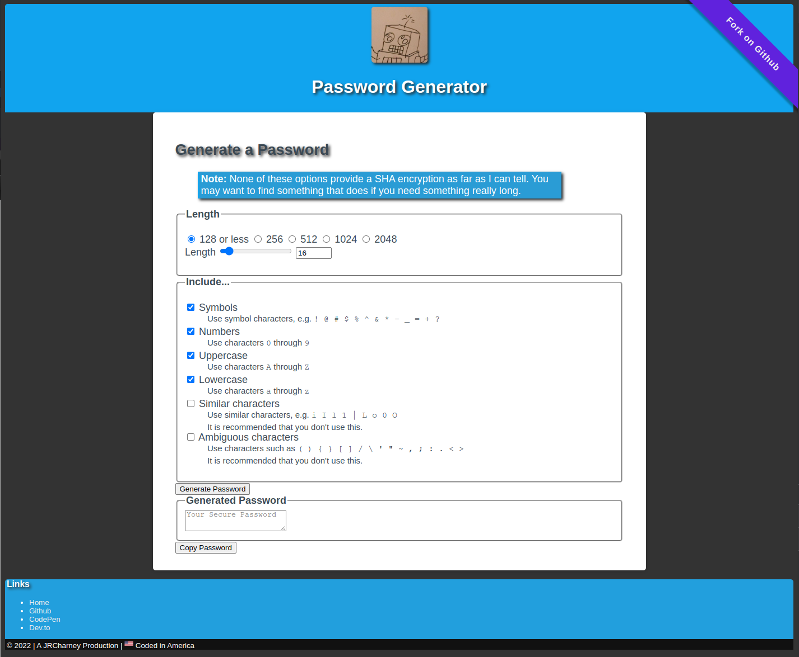

# Password Generator
Module 3 Challenge

[](https://jrcharney.github.io/password-generator/)

## Your Task

This week's Challenge requires you to create an application that an employee can use to generate a random password based on criteria they've selected. This app will run in the browser, and will feature dynamically updated HTML and CSS powered by JavaScript code that you write. It will have a clean and polished user interface that is responsive, ensuring that it adapts to multiple screen sizes. This week's coursework will teach you all the skills you need to succeed in this assignment.

The password can include special characters. If you're unfamiliar with these, see this [list of Password Special Characters from the OWASP Foundation](https://owasp.org/www-community/password-special-characters)


## User Story

```
AS AN employee with access to sensitive data
I WANT to randomly generate a password that meets certain criteria
SO THAT I can create a strong password that provides greater security
```

## Acceptance Criteria

```
GIVEN I need a new, secure password
WHEN I click the button to generate a password
THEN I am presented with a series of prompts for password criteria
WHEN prompted for password criteria
THEN I select which criteria to include in the password
WHEN prompted for the length of the password
THEN I choose a length of at least 8 characters and no more than 128 characters
WHEN asked for character types to include in the password
THEN I confirm whether or not to include lowercase, uppercase, numeric, and/or special characters
WHEN I answer each prompt
THEN my input should be validated and at least one character type should be selected
WHEN all prompts are answered
THEN a password is generated that matches the selected criteria
WHEN the password is generated
THEN the password is either displayed in an alert or written to the page
```

## TODO List

> Note: I added some tasks that were not part of the acceptable criteria so that I could remind myself to do some things when I do these odd numbered assignements.

* [x] **Clone the [starter code](https://github.com/coding-boot-camp/friendly-parakeet)**
* [x] Rename folder from `friendly-parakeet` to `password-generator`
* [x] Move `index.html` from the `Develop` directory to the project root directory (one level up)
* [x] Create an `assets` directory in the project root directory
* [x] Move `Develop/style.css` to `assets/css/style.css`
* [x] Move `Develop/script.js` to `assets/js/script.js`
* [x] Make sure that `index.html` reflects the changes made to those two previous files.
* [x] **Modify the code to meet the Acceptable Criteria**
   * [ ] When the "Generate Password" button is clicked, ~~a series of prompts for passwords are asked.~~
      - UGH! Let's not do that. Alert prompts are so tacky. Let's use a form.
   * [x] When prompted for password criteria, select which criteria to include in the password.
      - You can't do this in a prompt. Let's use a form.
   * [x] Choose the length of the password between 8 and 128 characters.
      - I used a slider and a number field.
      - I was thinking about adding radio buttons for longer passwords.
      - NOTE: The instructor knows these passwords are not SHA encrypted, right? Propbably should ad a note letting people know that.
   * [x] Confirm wheter or not to include lowercase, uppercase, numeric, and/or special characters.
      - A check list would be better.
   * [x] Validate each prompt by selecting at least one character type from each set.
      - Again, this is much easier if we use a character list
   * [x] When all the prompts are answered, generate a password tha matches the selected criteria.
      - In other words, do some JavaScript to make a password
   * [x] When the password is generated, display it in an alert or written on the page.
      - I don't know about who wrote this assignement, but I'm keeping my stuff on the page.
      - Bonus: I'm adding a copy button.
      - Also, I'm swapping out all the `alert()`, `confirm()`, `prompt()` with a set of form elements because they look better and have better accessiblity (ARIA) features that we should be using.
* [x] **Ensure that your work meets the full list of grading requirements.**
* [x] **Reach out ot classmates and instructional support team for help if you need it.**
* [x] Add a screenshot of this project
* [x] **Follow the submission instructions.** Submit BOTH of the following for review:
   * [x] The URL of the deployed application.
   * [x] The URL of the Github repository. (Give the repo a unique name)
   * [x] Add a ribbon bug in the corner to link to the Github repo.

## Colophon: An Ode to `PasswordGenerator.net`

Until a few months ago, the website `PasswordGenerator.net` was the place to generate a password, and then it shut down.  Maybe the didn't pay their bills. Maybe hackers figured out how to crack the password generator. Maybe they just quit. Whatever the reason, if you try to go to `PasswordGenerator.net` nothing will show up.

In this project, I decided to follow in their example to build this project.

## Aliases!

I like to use alaises in my code such that I don't have to write long code. Eventually, these aliases will find their way into another file.

A good programmer will write code that makes there job easier.  While this may add processing time to the code, the increase in performace time is neglegable enough.

### `qs` Query Selector

`qs` combines `querySelector` and `querySelectorAll` into one function and makes it easier to write `querySelector(All)` assignments.

```javascript
let qs = (query,all=false) => document[`querySelector${all?"All":""}`](query);
```

Thanks to string interpolation, we can modify strings in array values. If the `all` function exists and is `true`, `document.querySelectorAll` (which will return a `NodeList`) will be used instead of `document.queryString` (which will return an `HTMLElement`).  With the power of the dot operator (Such that `a.b` is equivalent to `a["b"]`, we can use the appropriate function) sort of like a closure.

### `css` CSS getter and setter

```javascript
let css = (el) => (prop, val) => (val === undefined) ? getComputedStyle(el).getPropertyValue(prop) : el.style.setProperty(prop,val);
```

This function has a closure in it, as we can define a CSS object, and then get or set its properties later.

This function requires an element, which we could use our `qs` function to get one.

The second set of arguments allow us to do two things. 

The first argument, `prop`, is a string that is the name of a CSS property. Alternatively, `prop` could be a CSS variable and we can get the value of the CSS variable if it exists.

The second argument, `val`, could be a string or number.  If the `val` variable is not used or is `undefined`, `css` will return the value of a CSS property if it exists. If `val` does exist, we can set our CSS property or CSS variable.


### `root` constant
CSS uses the `:root` pseudo-element to place globally defined CSS variables...but JavaScript can't read that because there is no `:root` element in HTML. There is a way around this!

```javascript
const root = document.documentElement; 
```

We can assign `document.documentElement` to a variable called `root` which we can use as the element variable for `css` function and anywhere else that uses it.

### "Copy Password" button

An easy one-click button copies the password we created to the clipboard for easy pasting.

### ARIA Accessiblity
I'm not too familiar with [Accessible Rich Internet Application](https://www.w3.org/WAI/ARIA/apg/) <abbr title="Accessible Rich Internet Applications">ARIA</abbr>; I did try my best to apply ARIA tags to some of the interactive elements.

### Easy Theme Setup
If only HTML was as modular as CSS. Because CSS is so modular, major elements have their own stylesheets which can be imported to a single stylsheet. What's more, variables can be used across those files, which is great because now a new tyle `theme.css` has a `--hue` variable that can set the color scheme across several variables.  Eventually, CSS Math will be added to correct some saturation and lightness as all the colors are in `hsl` format.  It would also be nice to use gradients and transparency (alpha channel).

Need help picking out a color? Try this [CSS Color Converter](https://codepen.io/jrcharney/pen/WNybMBP).
